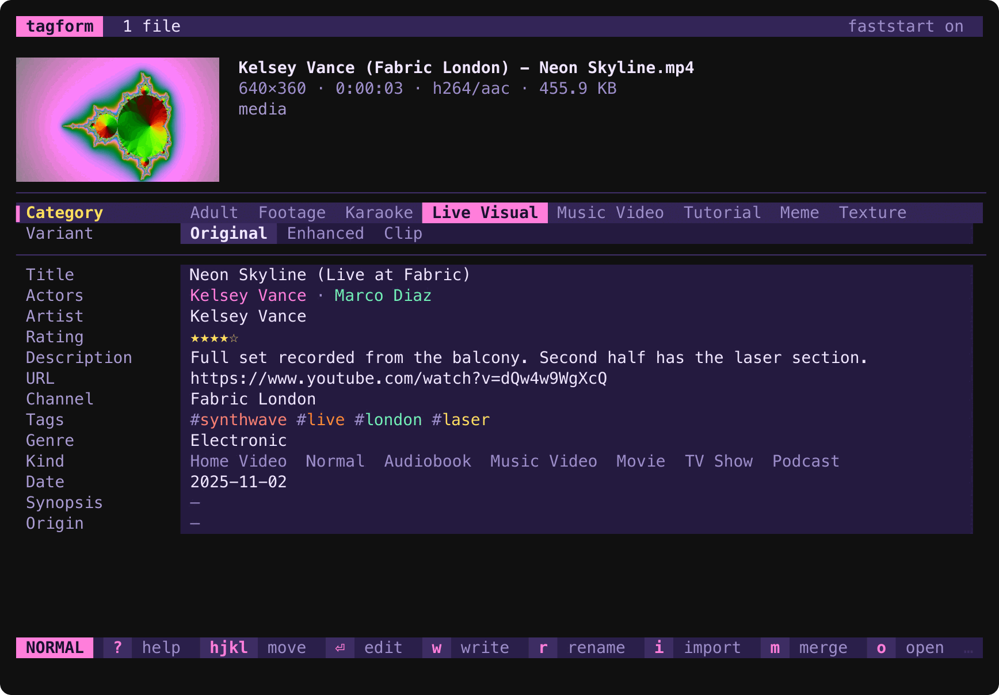
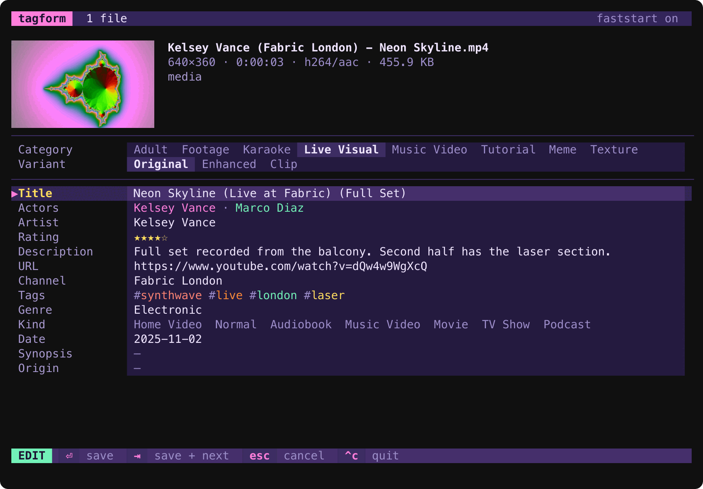
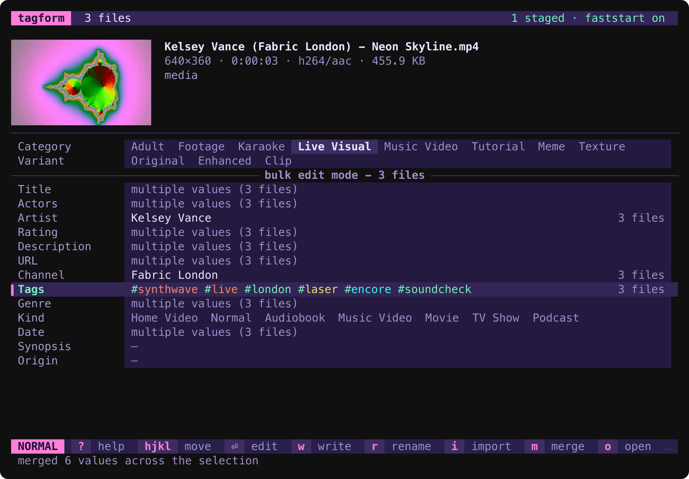
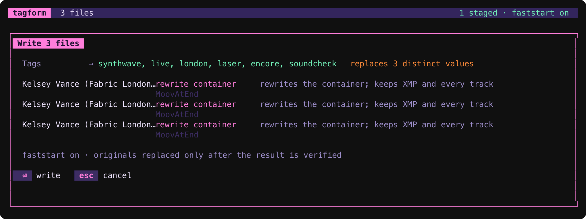
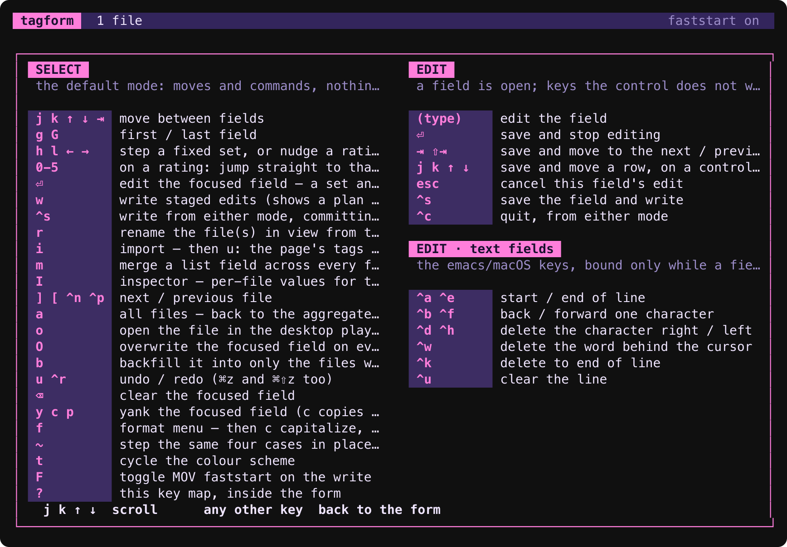
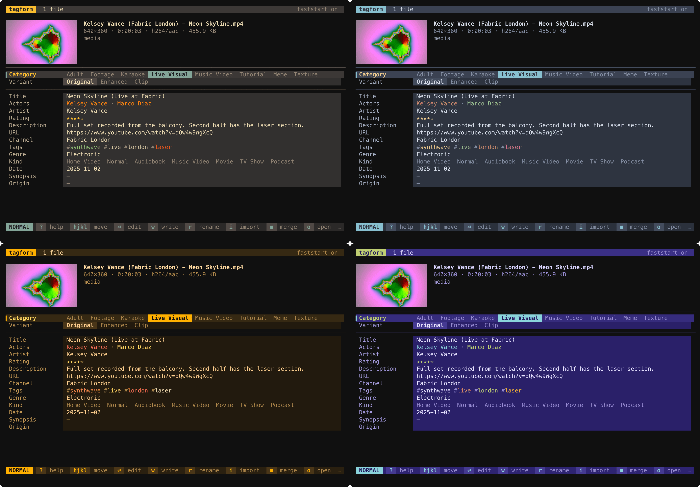

<h1 align="center">tagform</h1>

<p align="center">
  A form-based metadata tagger for MP4 and MOV, in the terminal.<br>
  Labelled fields, typed editors, star ratings and tag chips — not a list of key/value strings.
</p>

<p align="center">
  <a href="https://www.rust-lang.org"></a>
  
  
  
</p>

<p align="center">
  
</p>

`tagform` opens one file or a whole batch, shows every tag as a proper form
control, and writes the result back **without destroying anything it did not
touch**. It reads atoms and XMP together, picks a safe write backend from the
file's own contents, and never replaces an original until the new file has
been read back and verified.

## Why

Tagging video is harder than tagging music, and most tools quietly get it
wrong:

- **ffmpeg's default path drops half your keys.** It writes iTunes `ilst`
  atoms, which have no slot for `actors`, `channel`, `rating` or the source
  URL. `tagform` writes `mdta` keys, which hold anything.
- **An ffmpeg remux destroys XMP.** Silently, with no flag to stop it. If a
  camera or `exiftool` put people, places and ratings in XMP, a remux throws
  them away. `tagform` detects XMP and chooses a writer that keeps it.
- **iPhone clips carry timed-metadata tracks** for orientation and Live
  Photos. A remux cannot carry them. `tagform`'s native container rewrite can.
- **Batch tagging is what you actually do.** Open twenty clips from one show
  and `tagform` behaves like an mp3 tagger: agreed values show once, differing
  values say so, and one key fills, merges or overwrites a field across the lot.

## Install

You need `ffmpeg`, `ffprobe` and `exiftool` on your `PATH`, and a Rust
toolchain.

```bash
cargo install --git https://github.com/monomadic/tagform
```

Or build from a checkout:

```bash
cargo build --release   # binary at target/release/tagform
```

`assets/tagform.exiftool.cfg` is a required runtime asset: without it exiftool
refuses to write this library's custom `Keys:` tags. Keep it next to the binary
or where the source tree left it.

Optional: `yt-dlp` backs the `i u` import, and `rename-video` backs the `r`
rename. Nothing else needs them.

## Quick start

```bash
tagform clip.mp4                 # open one file
tagform show/*.mp4               # open a batch — bulk edit mode
tagform --print-json clip.mp4    # what tagform sees, as JSON
tagform --print-schema           # every field and the keys it reads/writes
```

Inside the form: `j`/`k` move, `enter` edits, `h`/`l` step a set or nudge a
rating, `w` writes, `?` shows every key. That is enough to start.

## A tour

### Typed controls, not strings

Text, multi-line text, lists drawn as chips, `#hashtags`, validated URLs,
dates, a 0–5 star row, and fixed sets that draw all their options on the
field's own line with the current one lit. Every tag in a list gets its own
colour, hashed from its text, so `#live` is the same colour in every file.

<p align="center">
  
</p>

The form is **modal**, like vim: Select mode moves and commands, Edit mode
types. That frees the single-letter keys — `w` can mean *write* because in
Select mode nothing is listening for the letter w. Text fields take the
emacs/macOS editing keys (`ctrl-a`, `ctrl-e`, `ctrl-w`, `ctrl-k`, …).

### Bulk edit across a whole selection

Open more than one file and the form becomes the aggregate. A field the files
agree on shows once with the count beside it; one they disagree on reads
`multiple values (3 files)` and is left alone unless you set it.

<p align="center">
  
</p>

- `m` **merges** a list field: the union of every file's values, first-seen
  order, case-folded. Here Tags became the union of three files' hashtags.
- `O` **overwrites** the focused field on every open file.
- `b` **backfills** it into only the files where it is still empty — the
  one-key way to give a batch a Channel without clobbering the ones that
  already have their own.
- `[` / `]` walk the selection file by file. Edits belong to the files they
  were made on, and `w` writes all of them at once.

### Nothing is written blind

`w` shows a plan first: which fields change, which files they land on, which
backend writes each one and why, and what a `multiple values` field is about
to flatten.

<p align="center">
  
</p>

The original is **never modified until a verified replacement exists**. The
writer builds a sibling temp file, proves its duration, tags and layout, and
only then renames it over the original. Any failure leaves the original
untouched. Keys no field claims are carried through unchanged.

### Import from the web or the filename

`i` opens the import band, a two-line selector: `j`/`k` move between the
sources with each one's preview under the cursor, `⏎` runs the one selected,
`esc` closes. `u` fetches the page behind the URL field with `yt-dlp`
(metadata only, nothing is downloaded, and a video this account cannot play
still yields its tags) and stages Title, Actors, Channel, Description, Tags
and Date. `f` parses the filename instead: `#tags`, `★` stars, and
`Actor, Actor (Channel) - Title`, filling only the fields that are still
empty. Both letters still work without moving the cursor first.

### Help is one key away

`?` opens the full key map, which is rendered from the same table as `--help`.

<p align="center">
  
</p>

### Seven colour schemes

`synthwave` (default), `c64`, `midnight`, `gruvbox`, `nord`, `rose-pine` and
`amber`. Cycle with `t` or pick with `--theme=NAME`. Every scheme is held to a
WCAG 3:1 contrast floor by a test, including the focused-row fill and the tag
ring.

<p align="center">
  
</p>

## Keys

**Select** (default)

| key | |
|---|---|
| `j` / `k`, arrows, `tab` | move between fields (`g` / `G` first / last) |
| `h` / `l` | step a fixed set, or nudge a rating — both are edited only this way |
| `0`–`5` | on a rating: jump straight to that many stars |
| `enter` | edit the focused field — on an empty date, fill it with now first; a set and a rating never open |
| `w` | write staged edits (shows a plan first) |
| `ctrl-s` / `cmd-s` | the same, from either mode — commits the open field first (`cmd` needs a terminal with the kitty keyboard protocol) |
| `r` | rename the file — or every file in the selection — from the tags on disk, by running `rename-video` |
| `i` | import — `j`/`k` pick a source and `⏎` runs it, or name one outright: `u` fetches the page behind the URL field with `yt-dlp`, `f` reads the filename. A fetch takes the page's word; a filename fills only the fields that are still empty. `u` takes either back in one step |
| `m` | merge a list field across every file in the selection |
| `I` | inspector — per-file values for the focused field |
| `]` / `[` (or `ctrl-n` / `ctrl-p`) / `a` | next file / previous file / all files |
| `o` | open the file in whatever the desktop plays it with |
| `O` / `b` | overwrite the focused field on every file / backfill it into only the files where it is empty |
| `u` / `ctrl-r` | undo / redo — `cmd-z` and `cmd-shift-z` do the same |
| `backspace` | clear the focused field |
| `y` (or `c`) / `p` | yank the focused field / paste into it |
| `f` | format menu — then `c` capitalize, `t` title (the little words stay lowered), `l` lower, `u` upper |
| `~` | step those same four cases in place, without the menu |
| `t` | cycle the colour scheme |
| `?` | the key map — every binding in the form, on a screen of its own |
| `F` | toggle MOV faststart on the write (on by default) |
| `q` / `esc` | quit (asks if edits are staged) |

**Edit**

| key | |
|---|---|
| (type) | edit the field |
| `enter` | save and stop editing |
| `tab` / `shift-tab` | save and move to the next / previous field |
| `j` / `k`, `↑` / `↓` | save and move a row — on a control with no text to type |
| `esc` | cancel this field's edit |
| `ctrl-s` / `cmd-s` | save the field and write |
| `ctrl-c` | quit, from either mode |

Text fields also take `ctrl-a` / `ctrl-e` (start / end), `ctrl-b` / `ctrl-f`
(back / forward), `ctrl-d` / `ctrl-h` (delete right / left), `ctrl-w` (delete
word), `ctrl-k` (delete to end) and `ctrl-u` (clear line). They bind only
while a field is open, so Select mode's single letters are untouched.

## The fields

Twenty fields in one flat list. The five footage fields (Location, State,
Country, Coordinates, Original name) appear only when a file in the selection
carries them. Anything on disk that no field claims gets a row of its own at
the bottom, atoms and XMP alike.

`--print-schema` is where the vocabulary is documented: every field with the
keys it **writes** (`mdta`), the aliases it **understands** on read, its XMP
tag and its iTunes atom. It is emitted from `FIELDS` in
[src/model/schema.rs](src/model/schema.rs), the single authority.

**Read is deliberately wider than write.** A URL may arrive as `comment`,
`purl`, `source_url`, `webpage_url` or `original_url`; a write emits only the
canonical set. That asymmetry is what makes `tagform` idempotent.

**Category `Footage` reshapes the form.** Artist, URL, Channel and Synopsis go
(a camera file was not published anywhere), Actors is labelled **People**, and
the order becomes Category, Variant, Date, People, Rating, Tags, Title,
Description. Hiding is display only: those keys are still read and written
back untouched.

**Category and Variant are not hardcoded.** They are parsed out of
`~/.config/yt-dlp/config`'s `--alias` lines, so adding an alias there adds a
value here. A value already on a file that the list does not know joins the
set for that field rather than being lost. Older spellings (`Camera Footage`,
`Media`, `Master`, `VJ Clip`) read as their current names and are rewritten
only when the field is edited.

**Category is what used to be called Genre**: what kind of thing the file is.
Genre is still there, on `genre`/`©gen`, as an ordinary text field holding the
style that Plex, Jellyfin and Music.app read.

## The three things to know

These were measured, not assumed — the numbers are in
[docs/CONTAINER.md](docs/CONTAINER.md) and reproducible with
`tests/container-experiment.sh`.

**1. This library is `mdta`, not iTunes.** Tags live in `moov/udta/meta` under
the `mdta` handler with arbitrary key names. The default ffmpeg path writes
iTunes `ilst` atoms instead and **silently drops** `actors`, `variant`,
`channel`, `rating`, `origin`, `source_url`, `webpage_url`, `purl` and
`yt_dlp_id` — 9 of 20 keys. The two layouts are mutually exclusive.

**2. XMP is invisible to ffprobe.** People, tags, channel, location and rating
written by exiftool live in XMP, and a reader using ffprobe alone concludes
the file has no metadata at all. `tagform` always runs both readers.

**3. An ffmpeg remux destroys XMP** — totally, silently, with no flag to
prevent it — **and cannot carry an iPhone clip's timed-metadata tracks**. That
is why the writer chooses its backend from the file's *contents*, never from a
preference: exiftool in place for a plain update, otherwise a native rewrite of
the container that adds keys while keeping both. ffmpeg remains the fallback
for the layouts the native writer declines. There is deliberately **no flag
to override the choice** — every such flag is a flag that lets you destroy XMP.

## Status

**Milestones 0–5 done; 6 mostly done.** Probe → model → aggregate → typed
controls → verified write, across a whole selection, with XMP read, written
and preserved.

Not built yet: composing the two filename grammars in-process (parsing them is
`i f`), the rest of seeding, headless `--set`/`--apply`, and a config file.
[DESIGN.md](DESIGN.md) §16 says what is next and why.

The CLI is five options: `--print-json`, `--print-schema`, `--no-thumbnail`,
`--theme=NAME`, `--help`. Everything else is a key inside the form.

## Development

```bash
cargo test                        # unit tests, plus a write-path suite on generated containers
cargo run -- FILE...              # the form
cargo run -- --print-json FILE... # the model as JSON — the fastest way to inspect a file
```

`cargo test` needs `ffmpeg` and `exiftool` on `PATH`; it generates its own
fixtures in a temp directory. The screenshots above are regenerated with
[docs/screenshots/capture.sh](docs/screenshots/capture.sh), which drives the
binary through a pseudo-terminal.

- **[DESIGN.md](DESIGN.md)** — the design, written ahead of the code. It marks
  what is not built (`⟨designed⟩`) and what shipped differently
  (`⟨built, differs⟩`).
- **[docs/CONTAINER.md](docs/CONTAINER.md)** — what ffmpeg and exiftool
  *actually* write, measured. Read before changing the write path.
- **[AGENTS.md](AGENTS.md)** — orientation for coding agents.

## License

MIT.
